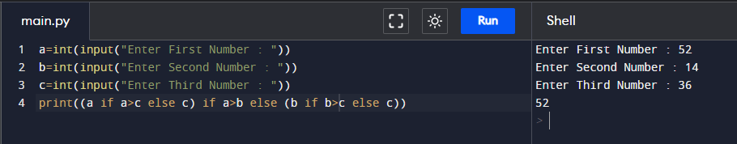

# Assignment - 6 Full Stack Web Development using Python MySirG Decision Control

    Qns 1. Write a python script to check whether a given number is positive or non-positive.

    Ans.

    Qns 2. Write a python script to check whether a given number is divisible by 5 or not.

    Ans.

    Qns 3. Write a python script to check whether a given number is even or odd.

    Ans.

    Qns 4. Write a python script to print greater between two numbers. Print number only once even if the numbers are the same.

    Ans.

    Qns 5. Write a python script to print two given words in dictionary order.

    Ans.

    Qns 6. Write a python script to check whether a given number is a three digit number or not.

    Ans.

    Qns 7. Write a python script to check whether a given number is positive, negative or zero.

    Ans.

    Qns 8. Write a python script to check whether a given quadratic equation has two real &
    distinct roots, real & equal roots or imaginary roots.

    Ans.

    Qns 9. Write a python script to check whether a given year is a leap year or not.

    Ans.

    Qns 10. Write a python script to print greater among three numbers. Print number only once even if the numbers are the same.

    Ans.

    Qns 11. Write a python script to take the month value in numeric format and display the
    number of days in it.

    Ans.

    Qns 12. Write a python script to accept one complex number from the user and display the greater number between real part and imaginary part.

    Ans.
